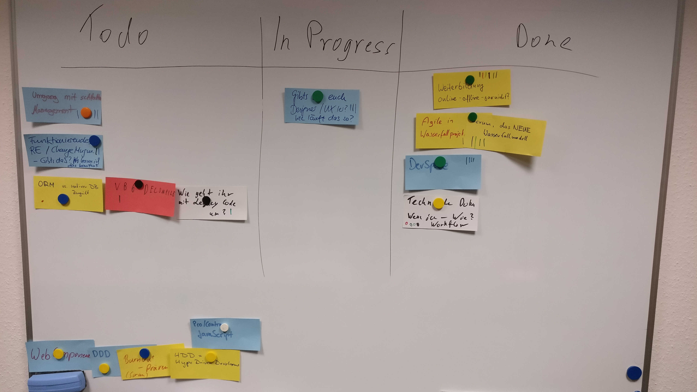

# Weiterbildung online, offline, gar nicht?

## online / Videos
* https://www.pluralsight.com/
* https://egghead.io/
* https://channel9.msdn.com/
* https://mva.microsoft.com/
* https://hacksummit.org/
* https://stackoverflow.com/
* https://www.raywenderlich.com/
* https://www.linkedin.com/learning/me?trk=nav_neptune_learning

## online / PodCasts
* Mein Scrum ist kaputt
* http://developerpodcasts.com/

## online / lesen
* http://www.hackernewsletter.com/
* https://news.ycombinator.com/
* https://www.joelonsoftware.com/
* Pragmatic Programmer (Broken Window)

## offline / Konferenzen
* Softwerkskammer
* Konferenzen
* UI/UX - Mensch und Computer
* MD DevDays
* Developer Open Space
* Spartakiade

# WaterScrum - Scrum/Agile im Wasserfall
* Buch: Nils Pfläging - Organisation für Komplexität: Wie Arbeit wieder lebendig wird - und Höchstleistung entsteht

# Technische Doku
* Code: JavaDoc
* Code: CompoDoc (Angular)
* Doxygen
* Confluence / Wiki
* GhostDoc (für API's - ansonsten mit Vorsicht zu genießen)
* interner StackOverflow Clone
* Doku so nah am Code, wie möglich (Markdown, AsciiDoc)
* Doku per Git Hook auf dem Server (GitHub) in HTML-Seiten überführen

# UI / UX 
* Sketch & Mural
* Balsamiq (https://balsamiq.com/)
* Indigo Studio (https://www.infragistics.com/products/indigo-studio)
* Axure (https://www.axure.com/)
* PowerPoint Storyboarding (Visual Studio Installation)

# Board

